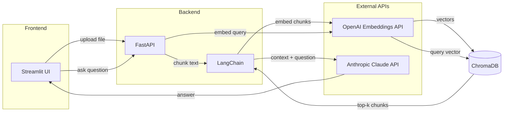

# DocuTalk

DocuTalk lets you have a conversation with your documents. Upload a PDF or text file, and ask questions about it — the app retrieves the most relevant passages and uses Claude under the hood to generate grounded answers.

It works using **Retrieval-Augmented Generation (RAG)**: instead of asking an LLM to rely on its training data alone (which can lead to hallucinations), we feed it the exact excerpts from your document that are relevant to your question. The LLM's job is reduced from "know everything" to "read and summarize what's in front of it," which is generally more reliable.

## Architecture



### How the pipeline works

**Indexing (upload):**
1. User uploads a PDF/TXT via the Streamlit frontend
2. FastAPI extracts text (using `pypdf` for PDFs)
3. Text is split into 1000-character chunks with 200-character overlap using LangChain's `RecursiveCharacterTextSplitter`
4. Each chunk is embedded via OpenAI's `text-embedding-3-small` and stored in ChromaDB

**Querying (chat):**
1. User asks a question
2. The question is embedded using the same OpenAI model
3. ChromaDB returns the top 3 most similar chunks
4. The chunks are injected as context into a prompt template
5. Claude Haiku 4.5 generates an answer based on the retrieved context

## Tech Stack

| Component | Choice | Role |
|-----------|--------|------|
| Frontend | Streamlit | Chat UI + file upload |
| Backend | FastAPI | REST API server |
| LLM | Claude Haiku 4.5 | Answer generation |
| Embeddings | OpenAI `text-embedding-3-small` | Text-to-vector conversion |
| Vector Store | ChromaDB | Similarity search over document chunks |
| Orchestration | LangChain | Chaining retrieval + LLM calls |

## Design Decisions and Tradeoffs

### Why separate embedding and LLM providers?

We use **OpenAI for embeddings** and **Anthropic (Claude) for generation**. Below are the reasons why:

- OpenAI's `text-embedding-3-small` is cheap ($0.02/1M tokens), fast, and well-supported in the LangChain ecosystem
- Claude Haiku 4.5 is used for generation because it offers a strong quality-to-cost ratio for RAG tasks, follows instructions well, and works effectively with provided context.

**Tradeoff:** Two API keys are required, and there is a small latency overhead because the app depends on two providers.

### Why cloud-based embeddings over local models?

Originally, the project used `sentence-transformers` to run the `all-MiniLM-L6-v2` embedding model locally. I later switched to OpenAI as I did not want to run an embedding model locally.

**Tradeoff:** Adds an external API dependency and per-request cost. For a personal/research tool, the cost is usually very low for small documents.

### Why ChromaDB?

- Zero-config, embedded vector database, no separate server to run
- Persists to disk out of the box (`chroma_db/` directory)
- Good enough for single-user, small-to-medium-sized document collections

**Tradeoff:** Not suitable for production-scale workloads. For larger deployments, Pinecone, Weaviate, or pgvector would be better choices.

### Why `RecursiveCharacterTextSplitter` with 1000/200?

- 1,000-character chunks are small enough to stay specific but large enough to preserve context
- 200-character overlap ensures sentences at chunk boundaries aren't lost
- `RecursiveCharacterTextSplitter` tries to split on paragraph or sentence boundaries before falling back to characters, which helps preserve semantic coherence

**Tradeoff:** Fixed chunk sizes don't adapt to document structure. Semantic chunking or document-aware splitting, such as splitting by section headers, could improve retrieval quality but would add complexity.

### Why FastAPI + Streamlit instead of a single app?

- **Wanted a UI instead of API docs** : I wanted to see how the project would feel in a chat interface instead of only accessing it through the API documentation. That made the project more alive to me. Streamlit was the easiest way to spin up a chat user interface and I was already familiar with the library.
I also did not want to spend a lot of time on other JavaScript libraries for the frontend because my main focus was understanding how RAG works, not building a chat UI.

- **Separation of concerns** : This backend can be reused with any frontend application.

**Tradeoff:** Two processes to run. For a production app, a React/Next.js frontend would give more control over UX.

## Setup

### Prerequisites

- Python 3.10+
- [Anthropic API key](https://console.anthropic.com/)
- [OpenAI API key](https://platform.openai.com/)

### Backend

```bash
cd backend
python -m venv .venv
source .venv/bin/activate
pip install -r requirements.txt
```

Copy `.env.example` to `.env`

```bash
cp .env.example .env
```

Open the .env file 
```bash
nano .env
```
Add your API keys.

Start the server:

```bash
uvicorn main:app --reload
```

### Frontend

```bash
cd frontend
python -m venv .venv
source .venv/bin/activate
pip install -r requirements.txt
```

Copy the contents of `.env.example` to `.env`

```bash
cp .env.example .env
```

Open the .env file 
```bash
nano .env
```

Replace the `BACKEND_URL` with your FastAPI's address. The server by default runs on port 8000.

```env
BACKEND_URL=http://localhost:8000
```

Start the app:

```bash
streamlit run app.py
```

## API Endpoints

| Method | Endpoint | Body | Description |
|--------|----------|------|-------------|
| POST | `/upload` | `multipart/form-data` (file) | Upload a PDF or TXT file for indexing |
| POST | `/chat` | `{"question": "..."}` | Ask a question about uploaded documents |

## Project Structure

```
DocuTalk/
├── backend/
│   ├── main.py              # FastAPI app — upload, chunking, retrieval, LLM chain
│   ├── requirements.txt
│   └── .env                 # ANTHROPIC_API_KEY, OPENAI_API_KEY
├── frontend/
│   ├── app.py               # Streamlit chat UI with file uploader
│   ├── requirements.txt
│   └── .env                 # BACKEND_URL
├── LICENSE
└── README.md
```

## Planned Improvements
- Prepare a strategy to evaluate the performance of the RAG system
- Add logging
- Handle multiple files in a better manner


## License

MIT
