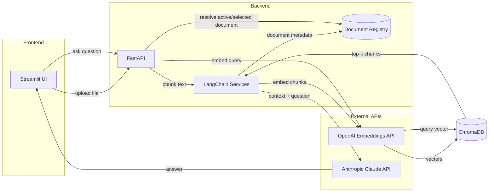

# DocuTalk

DocuTalk lets you have a conversation with your documents. Upload a PDF or text file, choose a chunking strategy, index it, and ask grounded questions against the selected document.

It works using **Retrieval-Augmented Generation (RAG)**: instead of asking an LLM to rely on its training data alone (which can lead to hallucinations), we feed it the exact excerpts from your document that are relevant to your question. The LLM's job is reduced from "know everything" to "read and summarize what's in front of it," which is generally more reliable.

## Architecture



### How the pipeline works

**Indexing (upload):**
1. User uploads a PDF/TXT via the Streamlit frontend
2. User selects a chunking preset based on the document type
3. FastAPI extracts text (using `pypdf` for PDFs)
4. Text is split with a preset chunk size / overlap strategy using LangChain's `RecursiveCharacterTextSplitter`
5. Each chunk is embedded via OpenAI's `text-embedding-3-small` and stored in ChromaDB with document-scoped metadata
6. The uploaded document is registered as the active document for future chat requests

**Querying (chat):**
1. User asks a question against either an explicit `document_id` or the active document
2. The question is embedded using the same OpenAI model
3. ChromaDB returns the top 3 most similar chunks for that specific document
4. The chunks are injected as context into a prompt template
5. Claude Haiku 4.5 generates an answer based on the retrieved context
6. The API returns the answer along with lightweight source snippets

## Tech Stack

| Component | Choice | Role |
|-----------|--------|------|
| Frontend | Streamlit | Chat UI + file upload |
| Backend | FastAPI | REST API server |
| LLM | Claude Haiku 4.5 | Answer generation |
| Embeddings | OpenAI `text-embedding-3-small` | Text-to-vector conversion |
| Vector Store | ChromaDB | Similarity search over document chunks |
| Orchestration | LangChain | Chaining retrieval + LLM calls |

## Design Decisions and Tradeoffs

### Why separate embedding and LLM providers?

We use **OpenAI for embeddings** and **Anthropic (Claude) for generation**. Below are the reasons why:

- OpenAI's `text-embedding-3-small` is cheap ($0.02/1M tokens), fast, and well-supported in the LangChain ecosystem
- Claude Haiku 4.5 is used for generation because it offers a strong quality-to-cost ratio for RAG tasks, follows instructions well, and works effectively with provided context.

**Tradeoff:** Two API keys are required, and there is a small latency overhead because the app depends on two providers.

### Why document-scoped retrieval?

Each upload is now assigned a `document_id`, and retrieval is filtered to that document instead of searching one shared global pool.

- Prevents chunk leakage between unrelated uploads
- Makes multi-document iteration safer while keeping the API simple
- Allows the frontend to keep chatting against the last indexed document without re-uploading it

**Tradeoff:** Adds document state management and a small registry layer on top of the vector store.

### Why cloud-based embeddings over local models?

Originally, the project used `sentence-transformers` to run the `all-MiniLM-L6-v2` embedding model locally. I later switched to OpenAI as I did not want to run an embedding model locally.

**Tradeoff:** Adds an external API dependency and per-request cost. For a personal/research tool, the cost is usually very low for small documents.

### Why ChromaDB?

- Zero-config, embedded vector database, no separate server to run
- Persists to disk out of the box (`chroma_db/` directory)
- Good enough for single-user, small-to-medium-sized document collections

**Tradeoff:** Not suitable for production-scale workloads. For larger deployments, Pinecone, Weaviate, or pgvector would be better choices.

### Why `RecursiveCharacterTextSplitter` with 1000/200?

- 1,000-character chunks are small enough to stay specific but large enough to preserve context
- 200-character overlap ensures sentences at chunk boundaries aren't lost
- `RecursiveCharacterTextSplitter` tries to split on paragraph or sentence boundaries before falling back to characters, which helps preserve semantic coherence

**Tradeoff:** Fixed chunk sizes don't adapt to document structure. Semantic chunking or document-aware splitting, such as splitting by section headers, could improve retrieval quality but would add complexity.

### Why preset-based chunking instead of one static strategy?

Research papers, reports, and transcripts often behave differently during retrieval, so the upload flow now lets the user choose among a few curated chunking presets.

- `Research Paper`: keeps the original balanced default for structured academic PDFs
- `Article / Report`: uses larger chunks for smoother prose and long-form sections
- `Notes / Transcript`: uses smaller chunks for rapid topic shifts, bullets, and conversational text

**Tradeoff:** This is more flexible than a single global strategy, but still simpler and safer than exposing raw chunk-size tuning to every user.

### Why FastAPI + Streamlit instead of a single app?

- **Wanted a UI instead of API docs** : I wanted to see how the project would feel in a chat interface instead of only accessing it through the API documentation. That made the project more alive to me. Streamlit was the easiest way to spin up a chat user interface and I was already familiar with the library.
I also did not want to spend a lot of time on other JavaScript libraries for the frontend because my main focus was understanding how RAG works, not building a chat UI.

- **Separation of concerns** : This backend can be reused with any frontend application.

**Tradeoff:** Two processes to run. For a production app, a React/Next.js frontend would give more control over UX.

## Setup

### Prerequisites

- Python 3.10+
- [Anthropic API key](https://console.anthropic.com/)
- [OpenAI API key](https://platform.openai.com/)

### Backend

```bash
cd backend
python -m venv .venv
source .venv/bin/activate
pip install -r requirements.txt
```

Copy `.env.example` to `.env`

```bash
cp .env.example .env
```

Open the .env file 
```bash
nano .env
```
Add your API keys and keep the timeout/logging defaults unless you want to tune them:

```env
LOG_LEVEL=INFO
ANTHROPIC_API_KEY=your_anthropic_key
OPENAI_API_KEY=your_openai_key
OPENAI_EMBEDDING_MODEL=text-embedding-3-small
ANTHROPIC_CHAT_MODEL=claude-haiku-4-5-20251001
CHUNK_SIZE=1000
CHUNK_OVERLAP=200
RETRIEVE_K=3
MAX_UPLOAD_SIZE_BYTES=10485760
PROVIDER_MAX_RETRIES=2
OPENAI_TIMEOUT_SECONDS=30
ANTHROPIC_TIMEOUT_SECONDS=30
CHROMA_ANONYMIZED_TELEMETRY=false
```

Start the server:

```bash
uvicorn main:app --reload
```

### Frontend

```bash
cd frontend
python -m venv .venv
source .venv/bin/activate
pip install -r requirements.txt
```

Copy the contents of `.env.example` to `.env`

```bash
cp .env.example .env
```

Open the .env file 
```bash
nano .env
```

Replace the `BACKEND_URL` with your FastAPI's address. The server by default runs on port 8000.

```env
BACKEND_URL=http://localhost:8000
REQUEST_TIMEOUT_SECONDS=60
```

Start the app:

```bash
streamlit run app.py
```

## API Endpoints

| Method | Endpoint | Body | Description |
|--------|----------|------|-------------|
| GET | `/chunking-strategies` | - | List the available chunking presets and the default strategy |
| POST | `/upload` | `multipart/form-data` (`file`, optional `chunking_strategy`) | Upload a PDF or TXT file for indexing |
| GET | `/documents` | - | List indexed documents and the current active document |
| POST | `/documents/{document_id}/activate` | - | Mark a document as the default target for chat requests |
| DELETE | `/documents/{document_id}` | - | Remove a document and its embeddings |
| POST | `/chat` | `{"question": "...", "document_id": "optional"}` | Ask a question about the active document or an explicit document id |

### Example responses

`GET /chunking-strategies`

```json
{
  "default_strategy": "research_paper",
  "strategies": [
    {
      "key": "research_paper",
      "label": "Research Paper",
      "description": "Balanced chunks for sectioned academic writing, citations, and method-heavy PDFs.",
      "chunk_size": 1000,
      "chunk_overlap": 200
    }
  ]
}
```

`POST /upload`

```json
{
  "message": "Document indexed successfully!",
  "document_id": "2f2f1e74-3d8d-4c2e-b7eb-4b986c9f4201",
  "filename": "paper.pdf",
  "chunk_count": 12,
  "chunking_strategy": "research_paper",
  "chunk_size": 1000,
  "chunk_overlap": 200
}
```

`POST /chat`

```json
{
  "answer": "The paper argues that ...",
  "document_id": "2f2f1e74-3d8d-4c2e-b7eb-4b986c9f4201",
  "sources": [
    {
      "source": "paper.pdf",
      "page": 3,
      "chunk_index": 5,
      "excerpt": "..."
    }
  ]
}
```

## Recent Backend Improvements

- Refactored the backend from a single-file prototype into smaller config, schema, and service modules
- Added a persistent document registry so uploads can be listed, activated, and deleted cleanly
- Scoped retrieval to a single document to avoid mixing chunks from different uploads
- Added selectable chunking presets so indexing can be tuned by document type without exposing raw chunk parameters in the UI
- Added stronger upload validation, clearer service errors, and source snippets in chat responses
- Added request/provider timeouts and better logging so indexing failures surface instead of hanging silently

## Project Structure

```
DocuTalk/
├── backend/
│   ├── main.py              # FastAPI entrypoint and route wiring
│   ├── config.py            # Environment-backed backend settings
│   ├── logging_config.py    # Logging setup
│   ├── schemas.py           # Request/response models
│   ├── services/
│   │   ├── chunking.py           # Chunking strategy presets and splitter helpers
│   │   ├── document_registry.py  # Persistent metadata for indexed docs
│   │   ├── errors.py             # Service-layer exceptions
│   │   └── rag.py                # Ingestion, retrieval, and answer generation
│   ├── tests/
│   │   ├── test_api.py           # API-level tests with service overrides
│   │   ├── test_chunking.py      # Chunking preset tests
│   │   └── test_registry.py      # Registry behavior tests
│   ├── requirements.txt
│   └── .env                 # API keys, chunking, logging, and timeout settings
├── frontend/
│   ├── app.py               # Streamlit chat UI with upload/chat timeout handling
│   ├── requirements.txt
│   └── .env                 # BACKEND_URL, REQUEST_TIMEOUT_SECONDS
├── LICENSE
└── README.md
```

## Planned Improvements
- Expand the offline benchmark with negative / abstention cases
- Add score thresholds / better "answer not found in the document" handling
- Support OCR or another fallback path for scanned PDFs
- Improve multi-document workflows beyond the current active-document model
- Move from preset chunking toward structure-aware or semantic chunking for higher retrieval quality

## Offline Evaluation

An offline RAGAS-based evaluator is now scaffolded under `backend/evals/README.md`.

Use it to benchmark retrieval and answer quality on a fixed set of documents and questions instead of trying to evaluate arbitrary user uploads live.

The repo now includes a first curated benchmark at `backend/evals/datasets/docutalk_benchmark_v1.jsonl`, backed by deterministic text fixtures for all three chunking presets.

### Initial Benchmark Snapshot

The first full benchmark run on April 15, 2026 used:

- the curated `docutalk_benchmark_v1` dataset
- Anthropic `claude-haiku-4-5-20251001` as the RAGAS judge
- the real DocuTalk ingestion, chunking, retrieval, and answer-generation pipeline

Headline scores from that run:

| Metric | Score | What it means |
|--------|-------|---------------|
| Faithfulness | `0.8905` | The answer usually stays grounded in the retrieved context. |
| Answer Relevancy | `0.8782` | The answer usually addresses the question that was asked. |
| Context Recall | `0.9333` | Retrieval usually brings back enough of the document to answer correctly. |
| Context Precision (with reference) | `0.9222` | Retrieved chunks are usually relevant instead of noisy. |

`answer_correctness` is still being treated as a work-in-progress metric for this project, so it is left out of the headline benchmark summary for now even though it is still emitted in the raw JSON/CSV reports.

### RAGAS Metric Summary

- `faithfulness`: checks whether the generated answer is actually supported by the retrieved chunks
- `answer_relevancy`: checks whether the answer is responding to the user question rather than drifting
- `context_recall`: checks whether retrieval brought back enough of the relevant information
- `context_precision_with_reference`: checks whether the retrieved chunks were useful and not mostly noise

### Findings

- Retrieval quality looks strong overall. Both context-oriented metrics landed above `0.92`, which is a good sign that the current chunking + Chroma retrieval path is usually fetching the right evidence.
- Grounding is also in a healthy range. A faithfulness score near `0.89` suggests the model is usually staying within the retrieved document rather than inventing unsupported claims.
- Chunking choice already shows measurable impact on benchmark rows. For example, `research_paper` outperformed `general_article` on the duplicated Montreal rollout question, and `notes_transcript` outperformed `general_article` on the transcript-heavy meeting-notes question.
- Single-row RAGAS scores can still be noisy, so the benchmark should be used mainly for trend comparison and regression detection rather than treating every individual row score as ground truth.

### Notes On Benchmark Warnings

- Transient Anthropic retry logs were observed during scoring. The run still completed successfully, so those retries are acceptable, but they do add latency and some variance.
- RAGAS also occasionally logged that it received 1 generation instead of the requested 3 for a prompt. That is not fatal, but it can make some metric values less stable between runs.


## License

MIT
